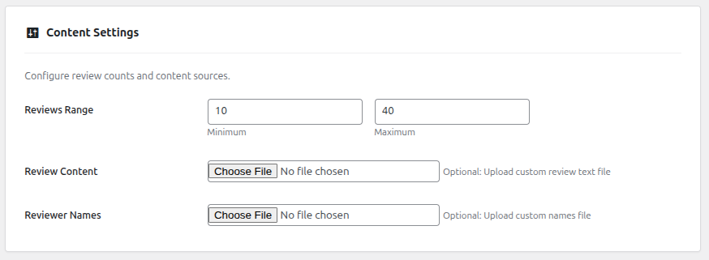

# WordPress Products <u>Faker Review</u> <mark>(Lite)</mark>

## Overview

Faker Review Lite is a simple WordPress plugin designed to generate realistic fake reviews for WooCommerce products. Perfect for development and testing environments, this plugin helps developers and store owners quickly add sample reviews to their products.

## Features

### 🎁 Free Features
- Generate up to 5 reviews per product
- Select up to 2 products at a time for reviews
- Unverified reviews only
- Balanced rating distribution (3-5 stars)
- Simple and intuitive interface

### ✨ Premium Features 🛒 [Buy Now](https://oxyian.com)

#### WooCommerce Bulk Products Review Generation ✨ (Available only in the Premium version.)

*Generate up to 500 reviews per product with a single click*

#### Custom Rating Distribution ✨(Available only in the Premium version.)

*Set your preferred rating distribution from 1-5 stars*

#### Date Range Configuration ✨ (Available only in the Premium version.)

*Configure custom date ranges for your reviews*

#### Category-based Selection ✨ (Available only in the Premium version.)

*Select products by category for targeted review generation*

#### Mixed Review Types ✨ (Available only in the Premium version.)

*Create a mix of verified and unverified reviews*

#### Custom Content Upload ✨ (Available only in the Premium version.)

*Upload your own review text and reviewer names*

#### Advanced Settings ✨ (Available only in the Premium version.)

*Fine-tune every aspect of your generated reviews*

## Installation

1. Upload the plugin files to `/wp-content/plugins/faker-review-lite/` directory
2. Activate the plugin through the 'Plugins' screen in WordPress
3. Ensure WooCommerce is installed and activated
4. Navigate to <mark> Tools > Faker Review</mark> to start using the plugin

### System Requirements

- WordPress 5.0 or higher
- WooCommerce 3.0 or higher
- PHP 7.2 or higher
- MySQL 5.6 or higher

## Usage Instructions

1. Go to Tools > Faker Review in your WordPress admin
2. Configure your desired settings:
   - Set rating distribution percentages (must add up to 100%)
   - Choose products to add reviews to (all or specific products)
   - Set the number of reviews per product (up to 500 per batch)
   - Optionally upload custom review content and names
   - Set the date range for reviews
   - Configure verified purchase settings
   - Customize email domain for reviewers (optional)
3. Click "Generate Reviews" button
4. Monitor progress through the built-in progress indicator

### Rating Distribution Example

You can customize the star rating distribution. For example:
- 5 stars: 40%
- 4 stars: 30%
- 3 stars: 15%
- 2 stars: 10%
- 1 star: 5%

## File Structure

- `faker-review-lite.php` - Main plugin file containing core functionality
- `indian_names.txt` - Default list of Indian names for reviewers
- `reviews.txt` - Default list of review content templates
- `languages/` - Translation files for internationalization
- `readme.txt` - Plugin readme for WordPress.org repository
- `uninstall.php` - Cleanup script that runs on plugin uninstall

## Customization

### Custom Names and Reviews

You can upload your own lists of names and review content through the admin interface:
- Files should be in .txt format
- One item per line
- UTF-8 encoding recommended
- No specific length limits
- Supports international characters

### Review Content Guidelines

For best results with custom review content:
- Keep reviews between 50-500 characters
- Include a mix of short and detailed reviews
- Use proper grammar and punctuation
- Avoid repetitive phrases
- Include product-specific terminology

### Default Files

The plugin comes with default files:
- `indian_names.txt` - Comprehensive list of Indian names
- `reviews.txt` - Varied collection of generic product reviews

## Performance Considerations

- Generate reviews in batches of 100-200 for optimal performance
- Large batches (400+) may temporarily impact server performance
- The plugin adds no overhead during normal site operation
- Reviews are stored as standard WooCommerce product reviews
- Bulk operations include progress indicators

## Supported Product Types

Works with all WooCommerce product types:
- Simple products
- Variable products
- Grouped products
- External/Affiliate products
- Virtual products
- Downloadable products

## Export and Management

- Generated reviews can be exported using WordPress comment export
- Reviews can be managed through standard WordPress review interface
- Bulk deletion available through WordPress admin
- Reviews are tagged internally for easy identification

## Important Notes

- This plugin is strictly for testing and development environments
- Using fake reviews on live stores may violate terms of service
- All generated data is fictional and for testing purposes only
- Keep regular backups before generating large amounts of data
- Consider server resources when generating bulk reviews

## Contributing

We welcome contributions! Please feel free to:
- Report bugs
- Suggest new features
- Submit pull requests
- Improve documentation

## License

GPLv2 or later
http://www.gnu.org/licenses/gpl-2.0.html
